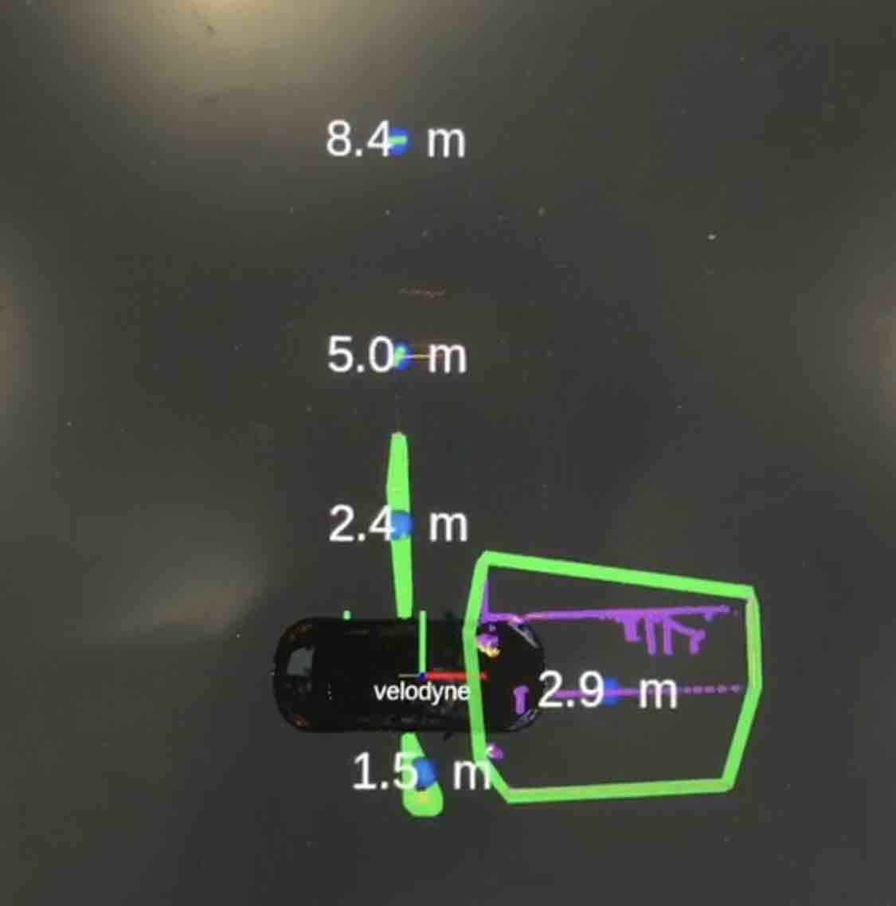
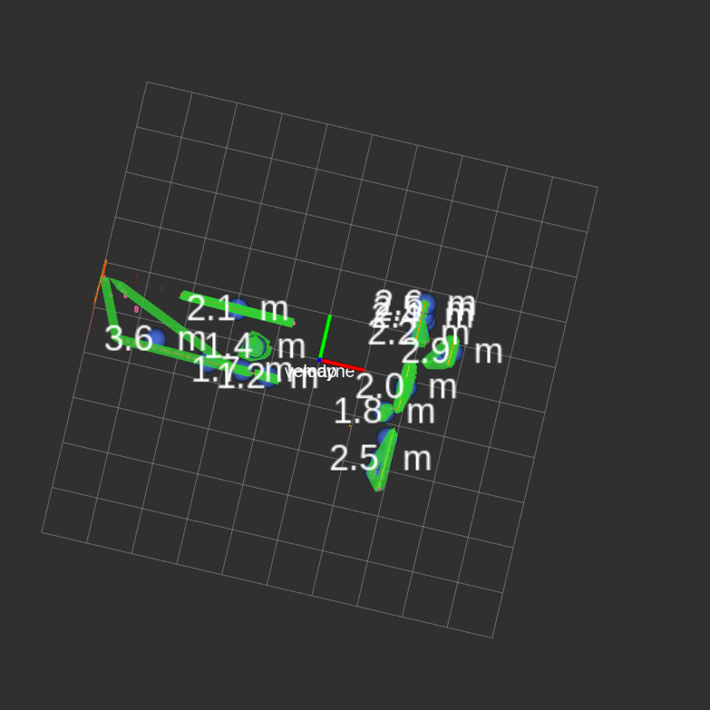

# Autoware Perception Module Tutorial

A workable point cloud clustering ros project based on autoware clustering module with dependencies extracted, and with added additional experimental support for protobuf msg and different pcl clustering options. Points filtering by 2d map features are supported as well.

## Code Explained

The main entry to the clustering module is via the `main()` in 

     src/lidar_euclidean_cluster_detect/nodes/lidar_euclidean_cluster_detect/lidar_euclidean_cluster_detect.cpp
After some param definitions, the main() runs point_cloud reception callback. The callback logic goes as the follows:

1. #### Point removal by distance: 

remove points according to specified distance, that points too faraway are ignored.

2. #### Point removal by voxel filter: 

points that are close and fall in a same voxel are downsampled to only one point.

3. #### Point removal by lane (disabled): 

points that fall outside a lane (a lane is defined as forward steering area constrianed by left and right lines)

4. #### Point Removal by Floor: 

3d laser scan is prone to including floor points and such information should be removed.

5. #### Point Segmentation by Difference Normals: 

Referenced link (https://pcl.readthedocs.io/projects/tutorials/en/latest/don_segmentation.html). 

Code entry: `void differenceNormalsSegmentation(const pcl::PointCloud<pcl::PointXYZ>::Ptr in_cloud_ptr,pcl::PointCloud<pcl::PointXYZ>::Ptr out_cloud_ptr)`

This algo attempts to exploit the information of differences of adjacent points' normals, and adjacent points with sudden changes normal differences (indicative of sudden changes of curvature of a local point cloud area) are removed. Visually, points that serves as joints of two or multiple distinct clusters are removed, since such points often have obvious changes of curvatures. This is useful when points are disconnected by segmentation so that clustering can stop once reaching vertices of a cloud/cluster of points. 

6. #### Point Clustering: 

Code entry: `void segmentByDistance(const pcl::PointCloud<pcl::PointXYZ>::Ptr in_cloud_ptr,pcl::PointCloud<pcl::PointXYZRGB>::Ptr out_cloud_ptr,
autoware_msgs::Centroids &in_out_centroids, autoware_msgs::CloudClusterArray &in_out_clusters)`

PCL provides a variety of algorithms for clustering, in which most useful ones are

1. Region Growing: by curvature and adjacent normal differences.

2. Euclidean Distance: by point Euclidean distance.

After init clustering, already clustered points go through re-merging so that small clusters are merged into larger clouds. Clusters' centroids are published and points are coloured. Polygons are published at this stage as well.

## Problems to be Solved

A key concern to this implementation is removal of empty space enclosed by polygons which are generated by crossed/connected lines.

The figure below shows an example of the aforementioned issue, that points formed stright lines are clusters but should remain separated. 

However, by varying clustering algos and relevant parameters, too much granularity can render polygons with minimal empty space, but derived polygons can hardly locate clusters, that clusters can easily split and merge due to sensitive parameter thresholding.

## Todo List

1. #### Init Filtering by Map Features: 

This perception module aims to provide guidance on local path planning for navigation. Path planning first finishes with a global path and the planning is through a built map. Local path planning only cares about foreign/temporary objects so that existing scanned objects such as walls can be removed. Temporary objects are key concerns to this perception implementation. This consideration facilitates computation as well as provides accurate clustering results.

Some concerns include computation efficiency and accurate addressing of point removal.

2. #### Protobuf Transmission

Protobuf provides possible higher data transmission speed. For polygon visualization by protobuf transmission, in 

     src/lidar_euclidean_cluster_detect/nodes/lidar_euclidean_cluster_detect/convert2protobuf.cpp
polygon protobuf data format is defined. Protobuf is a possible replacement of rostopic.

Protobuf messages are defined in proto dir:

    src/lidar_euclidean_cluster_detect/proto

3. #### Possible Clustering Improvements by Experimenting Different Algos

By now, this perception implemenetation has only experimented few clustering algorithms, and PCL provides more that shed light on possible clustering improvements.

Code entry: `std::vector<ClusterPtr> clusterAndColor(const pcl::PointCloud<pcl::PointXYZ>::Ptr in_cloud_ptr,
pcl::PointCloud<pcl::PointXYZRGB>::Ptr out_cloud_ptr,
autoware_msgs::Centroids &in_out_centroids,
double in_max_cluster_distance = 0.5)`, in which `customClusteringExt::clusterByNormalAndDist(...)` runs custom clustering algos defined in

    src/lidar_euclidean_cluster_detect/nodes/lidar_euclidean_cluster_detect/clusterExt.cpp
